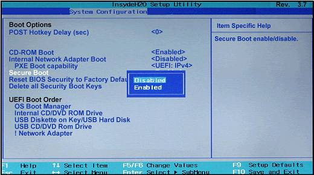

# Dual Booting Ubuntu

##

# Overview

1. [Pre-Installation](#pre-installation)
2. [Download](#download)
3. [Make Room](#make-room)
4. [Successful USB Boot](#successful-usb-boot)
5. [Install](#install)
6. [Boot Ubuntu](#boot-ubuntu)

## Pre-Installation
Before starting, make sure that you have the following:
- A computer with a **[UFEI boot mode](https://itsfoss.com/check-uefi-or-bios/)** and at least **16GB** of free space.
- A Backup of Windows and all your files.
- A seperate USB stick **2GB** or more.

## Download
Download the files on this **[Page](https://github.com/Chrisae9/installUbuntu/archive/master.zip)** or follow these links:

### **[Rufus](https://rufus.akeo.ie/)** and **[Ubuntu](https://www.ubuntu.com/download/desktop)**.
Start Rufus as Administrator select the Ubuntu.iso file.

## Make Room
There are multiple ways to open *Disk Partition* on Windows:
1. Open the start menu <kbd>⊞ Win</kbd> and type ***Disk Partition***.
2. Press <kbd>⊞ Win</kbd>+<kbd>R</kbd> to open the run dialog, then type `diskmgmt.msc` and hit enter.

### Find the disk for your Ubuntu installation *(Recommended to install on [SSD](https://en.wikipedia.org/wiki/Solid-state_drive) for better performance)*
Installing on the same drive as windows is perfectly normal. In this case, **Right Click** on the slice that says **"(C:)"** and `Shrink Volume...`.

### Important!
If you get the message below, go to the [solutions tab](#disable-the-unmovable-files).

### Enter a size in MB for your Ubuntu installation. 

*CAUTION: 1 Gigabyte is 1,024 Megabytes!*
- 16GB is 16384MB
- 30GB is 30720MB
- 50GB is 51200MB
- 64GB is 65536MB
- 100GB is 10240MB

## Successful USB Boot
1. [Fast Boot](#disabling-fast-boot)
2. [Secure Boot](#disabling-secure-boot)
3. [Boot Priority](#boot-priority)

If you already know how to boot into a USB you can **[Skip](##Install)** past this section.

### Disabling Fast Boot
Before you restart, you must disable **Fast Boot**.

Why?

>**DATA LOSS!!!** If you create a shared NTFS data partition, hibernation caused by Windows Fast Boot may maintain the current file structure. A problem arises when trying to save a file from Ubuntu into the NTFS partition, it will get lost on Windows reboot because the computer will remember the old file structure from when it was put in hibernation.

Navigate here to avoid this issue.

### Disabling Secure Boot
>Modern Windows PCs produced after Windows 8's release have UEFI firmware with “Secure Boot” enabled. This helps protect against rootkits and other malware infecting the Windows boot loader, but it can also prevent Ubuntu from booting.

Now you can reboot your computer and spam <kbd>F10</kbd> to get into the BIOS Setup menu.

If that doesn't work. Spam <kbd>F1</kbd> <kbd>F2</kbd> <kbd>F8</kbd> <kbd>F9</kbd> <kbd>ESC</kbd> or just google it.

### Boot Priority
Before you leave that menu. Find the **Boot tab** and move **Removable Devices** to the top. *If you have the USB plugged in, move it to the top*.

**MAKE SURE TO SAVE CHANGES ON EXIT!!!**

## Install
Plug in the USB if you haven't done so already, and start your computer.

### You should see a menu similar to this. **Select** Install Ubuntu.

### **Select** Language and connect to WiFi. **Check** both boxes and continue. 

### Next, **Choose** "Install Ubuntu alongside Windows" *If there is no option go to this [solution](#something-else-option).*

### Finally, **Fill** in the remaining boxes and wait for Ubuntu to finish installing.

##

## Boot Ubuntu
Restart your computer and remove the USB drive. Your computer should boot into [Grub](https://en.wikipedia.org/wiki/GNU_GRUB).

# Solutions

## Disable the unmovable files

>The answer is as same as the Disk Management message shows that the shrink space of C: drive is limited by unmovable files such as Hibernation, Page files and system protections. These files can’t be moved automatically by Windows built-in tool Disk Management, so you’ll need to manually disable the unmovable files.

### Disable System protection:
Press <kbd>⊞ Win</kbd>+<kbd>R</kbd> < enter `SystemProperitiesProtecion.exe` < press <kbd>Enter</kbd> < click `C: drive` < click `Configure` < select `Disable system protection` < click `Apply` < click `Yes` < restart.

##

### Disable Hibernation:
Click <kbd>⊞ Win</kbd> < type `CMD` in the Search box< right click `cmd`< choose `Run as administrator` < enter `powercfg.exe` /hibernate off”< press <kbd>Enter</kbd> < restart.

##

### Disable Page files: 
Press <kbd>⊞ Win</kbd>+<kbd>R</kbd> < type `SystemPropertiesPerformance.exe` < Press <kbd>Enter</kbd> < click `Advanced` < click `Change under Virtual Memory` < uncheck `Automatically manage paging file size for all drives` < click `C: drive` < set paging file size to `No paging file` < click `Set` < click `OK` < restart.

##

### Disable the kernel memory dump:
Click <kbd>⊞ Win</kbd>< select `Control Panel` < click `System and Security` < click `System` < click `Advanced system settings` < click `settings` under `Startup and Recovery` < Change the drop down menu under Write debugging information to `None`.

##

### IMPORTANT! Do not forget to re-enable these unmovable files after changing partition size of C: drive.

You can run [Disk Cleanup](https://www.disk-partition.com/articles/disk-cleanup-windows-10-4125.html) on the disk and [Disk Defragment](https://www.disk-partition.com/lib/how-to-defragment.html) for HDD to get more free space on C: drive.

## Something else option

Go ahead and **Click** the "Something Else" option.

### Select **Free Space** and hit the plus button.

### Next, make a **Swap Area** depending on how much RAM is in your computer

- RAM less than 2 GB: Swap should be double the size of RAM
- RAM between 2 to 4 GB: Swap should be RAM size + 2 GB
- RAM between 6 GB to 8 GB: Swap should be size of RAM
- RAM more than 8 GB: Swap should be half the size of RAM or less

### **Click** on the remaining free space and select these options.

##

